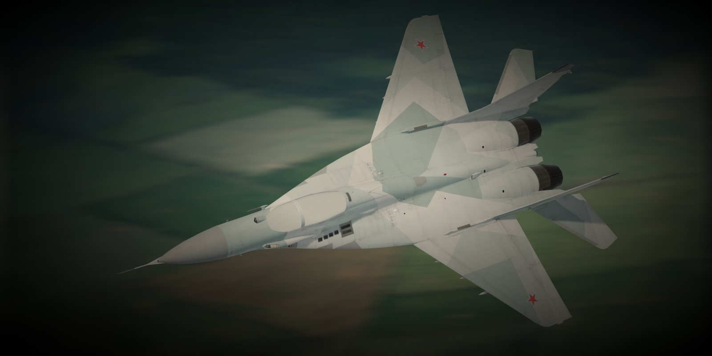
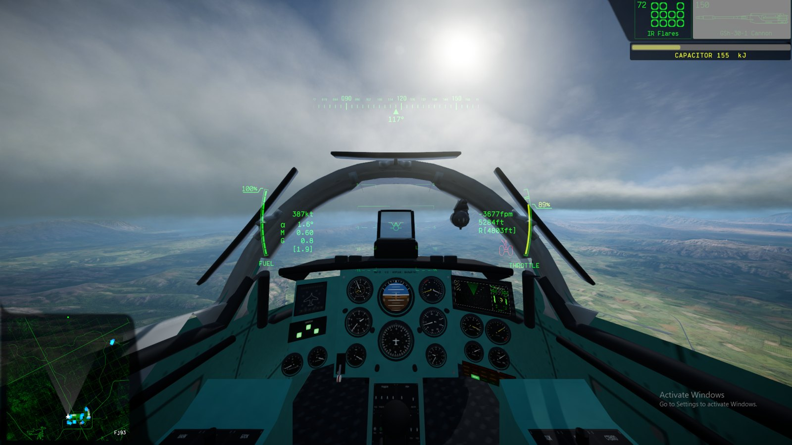
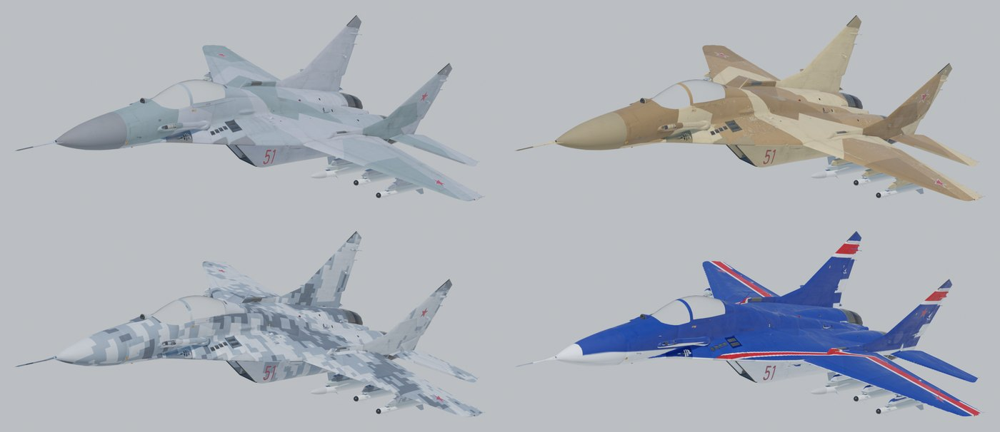

# MiG-29 Fulcrum for Nuclear Option

A flyable MiG-29 (9.12) mod for [Nuclear Option](https://store.steampowered.com/app/2168680/Nuclear_Option/). It has its own flight model
tuned to real-world data, a cockpit modelled from scratch where every instrument works, R-27R, R-27T, R-73 and R-60M missiles built from scratch, a GSh-30-1
cannon, droppable PTB-1500 / PTB-1150 fuel tanks, flares and radar chaff from its own tail-boom dispensers, a working canopy and gear
doors, a custom cockpit damage display, and nine liveries. Its three rear-view mirrors reflect with the
[NO Mirrors](https://github.com/IornMan1213/NuclearOption-Mirrors) plugin.

This mod was made with the assistance of AI (Anthropic's Claude), which helped write the code, tools and documentation.

**[Project page](https://iornman1213.github.io/MiG29-NuclearOption/) · [Releases](https://github.com/IornMan1213/MiG29-NuclearOption/releases) · [All builds](https://github.com/IornMan1213/MiG29-NuclearOption/tree/builds) · [Report an issue](https://github.com/IornMan1213/MiG29-NuclearOption/issues/new/choose)**

## Install (players)
1. Install [BepInEx 5](https://github.com/BepInEx/BepInEx) into the Nuclear Option folder.
2. Install [Blueprinter](https://github.com/nikkorap/NOBlueprinter-Releases) 2.0.1 or newer into `BepInEx/plugins`.
3. Install it with a mod manager that uses [NOMNOM](https://github.com/KopterBuzz/NOMNOM) (e.g. NOMM), or by hand: download
   `MiG-29-Fulcrum_x.y.z.zip` (or `MiG-29 Fulcrum_x.y.z.nobp` and `MiG29Instruments.dll`) from the newest
   [release](https://github.com/IornMan1213/MiG29-NuclearOption/releases) (every version is also on the
   [`builds` branch](https://github.com/IornMan1213/MiG29-NuclearOption/tree/builds)) and put both in
   `BepInEx/plugins/MiG-29_Fulcrum/`. Delete any older versions first. The DLL makes the cockpit instruments work and feeds the drop tanks' fuel.

See [mod/README.md](mod/README.md) for the full feature list and known limitations.

**Weapon modders:** [WEAPON_MODS.md](WEAPON_MODS.md) has everything needed to make your weapons selectable on the MiG
(its aircraft key, hardpoint sets and pylon clearances).

## Repository layout
| Path | What it is |
|---|---|
| `unity/MiG29Tools/` | Unity editor scripts that build the mod inside the [Blueprinter Editor](https://github.com/nikkorap) project: they clone the KR-67 Ifrit, swap in the MiG model, split it into the game's damage parts, and set up the flight model, weapons, canopy, gear doors, displays, liveries and loading screens |
| `unity/MiG29Instruments/` | The BepInEx plugin that drives the cockpit instruments from the live aircraft (`dotnet build`, against the installed game; `MiG29Tools/MiG29InstrumentMath.cs` is shared with the editor preview) |
| `tools/` | The headless build (`build_mig29.ps1`), the offline flight-model simulator (`fm_sim.py` + `fm_config.json`), the procedural missile, launcher and drop-tank generator (`missile_gen.py`), and the cockpit texture generator (`cockpit_atlas.py`: gauge faces, switch panels, caution lights) |
| `blender/` | The model export (`export_mig29.py`), the procedural cockpit (`cockpit_build.py`, fitted to the airframe), the loading-screen and showcase renders, and the measurement scripts used while fitting parts |
| `assets/loading/` | Loading screens (model renders over game terrain) |
| `docs/` | The GitHub Pages project site |
| `CHANGELOG.md` | What changed in each version |
| `DEVLOG.md` | The development journal, including the game internals the build relies on |

## Building from source
The Sketchfab model and the game's assemblies are **not** in this repo. You need:

- Nuclear Option, Unity 2022.3.62f2, the Blueprinter Editor project (set up with the game's assemblies, as its own instructions describe), Blender 4.2 or newer, and Python 3 with `numpy` and `Pillow`.
- The [MiG-29 model by bohmerang](https://sketchfab.com/3d-models/mig-29-fighter-jet-free-0a21787096244220b246ec8747e7b09c) (free download).

Steps:
1. Export the model into the project:
   `blender -b MiG-29.blend --python blender/export_mig29.py -- <project>/MiG29Source`
2. Prepare the textures (2K set, scorch texture, loading screens):
   `python tools/prepare_textures.py <sketchfab>/textures <project>/MiG29Source`
3. With Unity Hub running and signed in, run the build from PowerShell:
   `./tools/build_mig29.ps1 -Project <project>`. It copies `unity/MiG29Tools` into the project, generates the missiles, the
   flight-model export, the livery textures and the cockpit (atlas, then Blender), writes the `.nobp` to
   `<project>/MiG29Build/`, and builds `MiG29Instruments.dll` next to it (needs the .NET SDK and the game installed; pass
   `-p:GameDir=...` via the csproj if the game is elsewhere).
4. `-Release -Note "..."` also backs the build up to the `builds` branch; `python tools/gh_release.py <version>` publishes the
   GitHub release with both files.

`python tools/cockpit_atlas.py <project>/MiG29Source` and
`blender -b --python blender/cockpit_build.py -- <project>/MiG29Source <preview dir>` rebuild just the cockpit and render
previews. `MIG29_PRETTY=1 MIG29_POSE=sample` with `MiG29Tools.MiG29Preview.RenderCockpit` (via `tools/unity_run.ps1 -Graphics`)
renders the built cockpit from the pilot's eye with the instruments posed for a sample flight state.

To check flight-model changes offline, run `python tools/fm_sim.py`. It reads `tools/fm_config.json` and the part data
dumped from the built prefab (`tools/aero_reference.json`, refreshed with `MiG29Tools.MiG29AeroDump.Dump`).

## Licence
- **Source code** in this repository: [MIT](LICENSE).
- **The released `.nobp`** contains a converted and modified version of
  ["MiG-29 - Fighter Jet - Free"](https://sketchfab.com/3d-models/mig-29-fighter-jet-free-0a21787096244220b246ec8747e7b09c) by
  **bohmerang**, licensed [CC BY-NC-SA 4.0](https://creativecommons.org/licenses/by-nc-sa/4.0/). The release file is distributed under
  the same licence: it is free, non-commercial, and requires credit. Renders of the model in `docs/img/` and `assets/` are also covered by CC BY-NC-SA 4.0.
- Nuclear Option is by Shockfront. This is an unofficial fan mod with no affiliation to Shockfront. It uses the game's own
  KR-67 systems at runtime through Blueprinter and does not redistribute any game files.
